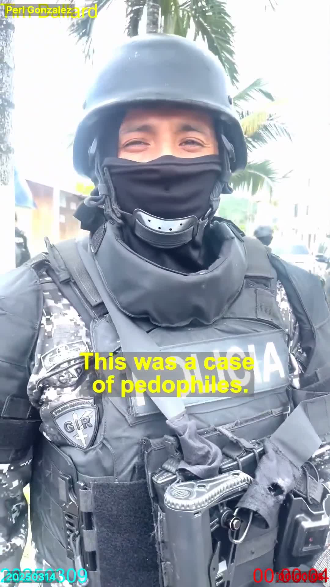
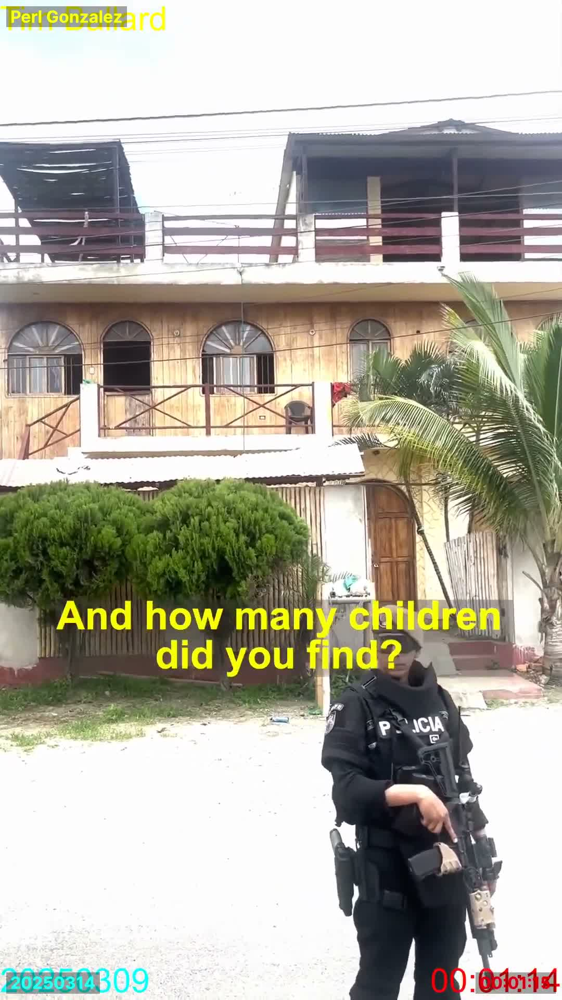
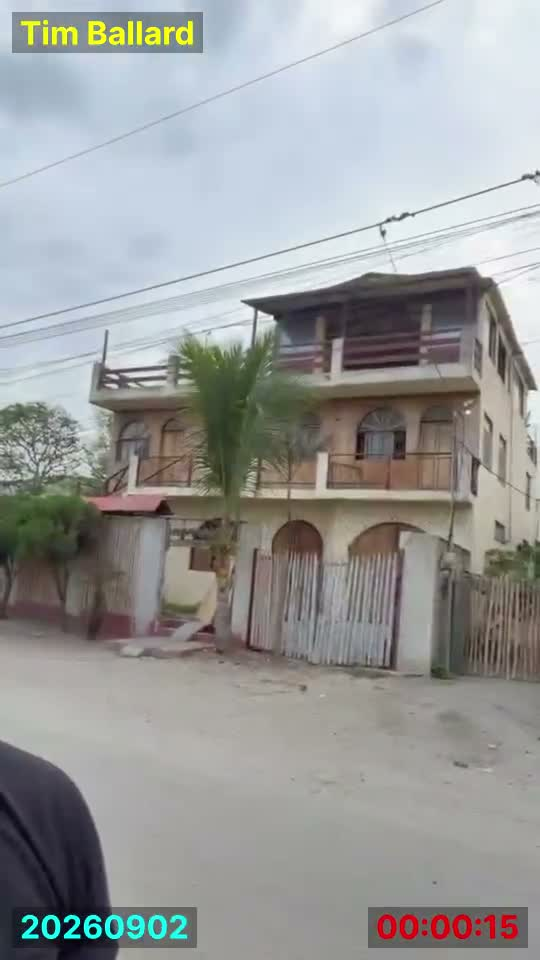
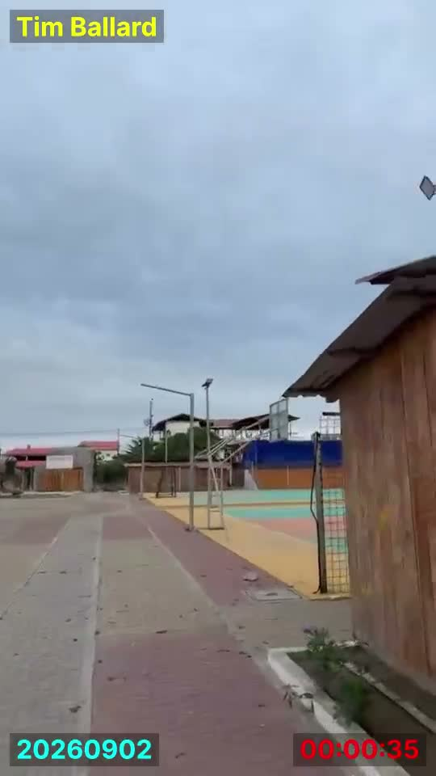
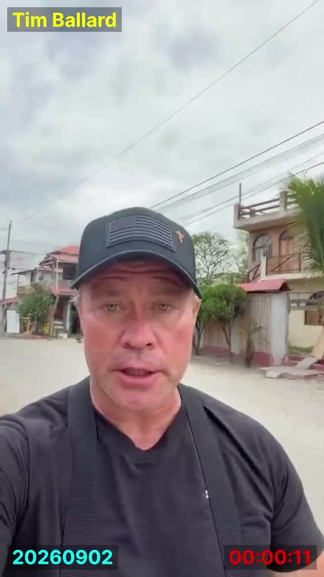
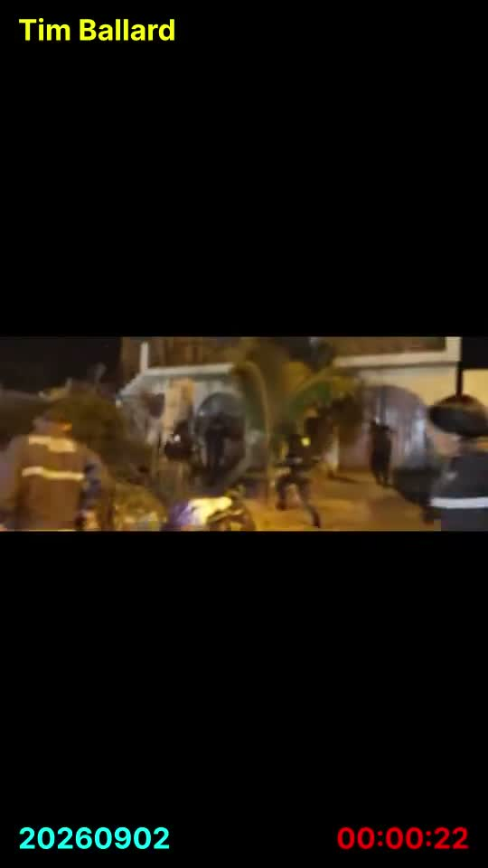
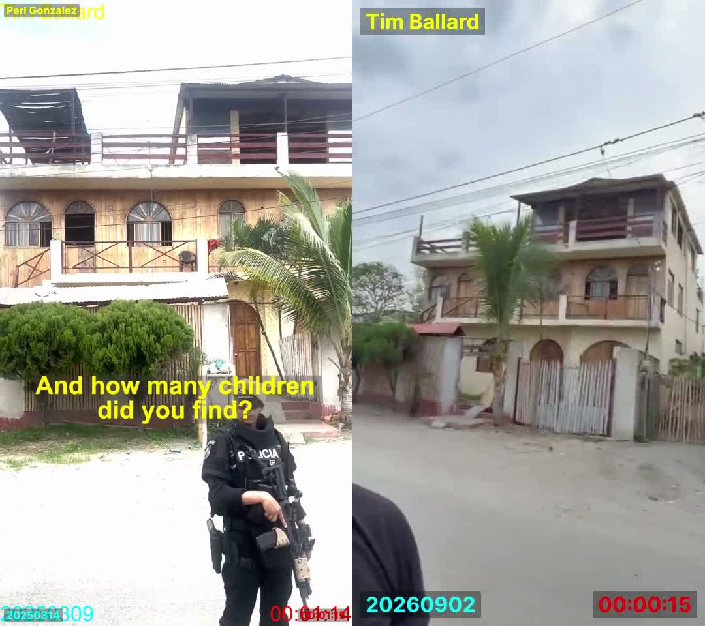

# Ecuador "house" claim — comparing a 2025 raid clip to a 2026 revisit clip

Two videos processed through the dl_wm pipeline (download, watermark, transcribe;
no scene-split or burn-in per instruction) to check a claimed trafficking-case
house in Ecuador across ~18 months. Per instruction, the watermark overlays use
the same scheme in both, so their burned-in dates are treated as the reliable
timestamp for each video, not upload metadata.

**Bottom line up front:** these are two different scenes. Two different houses
appear across the two videos, plus a third building and two spliced-in raid
inserts in Video B — none of it establishes the two videos are showing the same
location. Illustrations below back this up so the work doesn't have to be
retraced from scratch.

## Video A — the 2025 raid clip (contains two distinct houses)

- Source: YouTube, `wkBhvP_ONvM` (https://youtu.be/wkBhvP_ONvM)
- Uploader on YouTube: "Perl Gonzalez" (a re-upload, not the official Tim
  Ballard channel)
- **Double watermark** — two overlapping burned-in date stamps: `20250309`
  (yellow, matches the original file's title, "Tim Ballard 20250309
  watermarked") and `20250314` (teal, the reuploader's own layer), plus a
  duplicated running-time counter bottom-right. Confirms the file was
  watermarked once by the original source and again on re-upload — two dates,
  five days apart, both March 2025.

  

- Language: Spanish. Speaker: a masked officer in tactical gear, "POLICIA"
  vest, GIR patch (Grupo de Intervención y Rescate — Ecuadorian special police
  unit), palm trees visible, English captions overlaid translating his Spanish.
- Transcript (first ~60 clean seconds; degrades into hallucinated
  German/Russian/Hebrew/Chinese-script fragments after that — a Whisper
  failure, not content): describes a raid ("allanamiento") inside a
  residence, devices/videos involving children found, suspects reportedly
  Dutch, a Russian woman fluent in five languages acting as a go-between for
  negotiations abroad.
- **House #1** — the van-obscured house at 00:00:59 ("And this is the
  location?"), never seen clearly in this video.
- **House #2** — a wood-clad, two-story house with arched, barred
  second-floor windows and maroon-red horizontal-slat railings on both the
  balcony and a rooftop patio addition, single wood arched door at ground
  level. Appears repeatedly and clearly (00:01:09, 00:01:14, 00:02:09,
  00:02:29, 00:02:49) — this is the house the officer is standing in front
  of ("Russian woman was living," "how many children did you find") and
  where Ballard later stands talking with an older man. This is the
  cleanest, most-photographed building in the entire clip:

  

- Whether House #1 and House #2 are the same building, adjacent, or
  unrelated is not established by this video — the van-obscured shot and
  the clean shots are never connected by a matching pan or wide shot.

## Video B — the 2026 revisit clip

- Source: Facebook, `14oSnuEnbDL` (from the "Communism ALWAYS leads to
  death, destruction, and child abuse" post)
- Single watermark: `20260902` — no double-stamp, consistent with this being
  the first watermarking pass (ours) on a freshly-posted official clip, not
  a re-upload.
- Language: English. Speaker: Tim Ballard, walking, on a street in what he
  calls "Canola, Ecuador" (Whisper garble, real name unconfirmed). An inset
  world-map graphic (South America/Ecuador, credited "BeautifulWorld.com")
  appears briefly at 00:00:08 — a produced-video touch absent from Video A
  entirely.
- Transcript: "We are here in [Canola], Ecuador, doing a lot of big programs
  to develop this beautiful town... We recognize this behind me. We've seen
  this house. That is the house depicted in Hidden War."
- **The house** — a three-story cream/tan building: two arched ground-floor
  doorways plus a full-width gated entrance (red-and-white striped support
  columns), wood-plank middle floor with an arched window, an enclosed
  upper room under a peaked roof. Clean, unobstructed shots at 00:00:13,
  00:00:15, 00:00:17:

  

- **A sports/soccer court**, painted green-and-yellow with a goal frame,
  directly adjacent to the street at 00:00:35 — nothing like this appears
  anywhere in Video A:

  

- **A third, separate building** with a rounded/dark rooftop structure,
  visible further down the same street behind Ballard early in the clip —
  no equivalent in Video A:

  

- **Two spliced-in raid-footage inserts**, visually distinct from the
  handheld daylight walking footage that makes up the rest of the clip:
  one dark, blurry interior shot (00:00:25) and one nighttime exterior shot
  with multiple armed officers and a vehicle (00:00:22 in the timeline,
  shown below) — likely reused archival/stock footage rather than
  fresh-shot material, per earlier discussion. Video A has no B-roll
  cutaways at all; it's continuous handheld footage start to finish.

  

## Direct comparison: Video A's House #2 vs. Video B's house

Side-by-side of the two cleanest, most-comparable frontal shots:

| Feature | Video A, House #2 (left) | Video B house (right) |
|---|---|---|
| Balcony levels | Two stacked, both open rails, matching maroon-red slats | One enclosed upper room under a peaked roof — not a matching open rail |
| Ground floor | Solid wood wall, single arched door | Stucco wall, two arched doorways + full gated entrance |
| Wall material | Wood-plank cladding throughout | Cream stucco (lower), wood panel (middle) only |
| Roof | Flat-topped rooftop patio addition | Peaked/gabled roof over the top room |
| Color scheme | Natural wood tone, maroon-red accents | Cream/tan, brown wood balcony |

Structural details that would be expensive/unlikely to change in 18
months — door count, roof shape, balcony construction — don't match. The
shared elements (arched windows, a palm tree out front, bamboo fencing) are
the generic coastal-Ecuador building vernacular shared by most houses in
this style of town, not identifying features.

## Checked against the actual place — Canoa, via satellite/OSM/street-level imagery

"Canoa" is now confirmed and mapped (see
`backfire-tracking/docs/canoa_maps_verification_2026-09-14.md`) — satellite
imagery (Yandex/Airbus DS), OpenStreetMap's own feature data (Overpass),
and street-level photos (KartaView). Checked Video B's most distinctive,
most checkable detail against it: the painted sports court (teal/tan/orange
surface, blue side wall, goal frame, directly street-adjacent).

A painted, walled futsal-style court is exactly the kind of feature that
shows up clearly from above. Canoa is small — roughly 300–400 buildings
total — and no green/yellow/teal painted court appears anywhere in the
satellite imagery checked across multiple zoom passes. OpenStreetMap's own
crowdsourced data for the town (which does include a school, a cemetery, a
paragliding operator, and dozens of named streets) has exactly one tagged
sports pitch in the whole area, and it's a sand volleyball court — a
different sport, different surface, no visual match to what Video B shows.

Video B's unpaved dirt street isn't a reliable indicator either way — a
street-level photo of the town's actual plaza area shows at least
some paved roads with painted lane markings, so paving status alone
doesn't confirm or rule out a location.

This doesn't prove Video B was filmed somewhere else — satellite
resolution, imagery age (2017 credit on the tiles), and OpenStreetMap's
incompleteness in small towns all limit how far it goes. But the one
feature most likely to confirm the location claim if true has no match
anywhere in the actual town's mapped layout, while the only tagged court
there is a different sport entirely. That's evidence against the claim,
not proof of where the video was actually shot.

## Conclusion

These read as two different scenes, not a "then and now" of the same
location:

- Video A's House #2 and Video B's house are structurally different
  buildings (table above).
- Video A never establishes a connection between its own two houses
  (#1, the van-obscured one, and #2, the wood one) — no pan or wide shot
  links them.
- Video B contains a sports court, a third building, an inset map
  graphic, and two spliced raid-footage inserts — none of which have any
  counterpart in Video A.
- Nothing in either transcript ties the two clips to the same address,
  street, or case beyond both being generically "in Ecuador" and both
  involving a house tied to a child-exploitation claim.
- Video B's sports court has no match anywhere in Canoa's actual satellite
  imagery or OpenStreetMap data, which instead shows the town's only
  tagged sports facility as an unrelated volleyball pitch.

## Open items

- Video A's Spanish transcript degrades badly after ~60 seconds — would
  need a re-listen or better transcription if the rest of the officer's
  account matters.
- Whether Ballard gestures toward a specific neighboring building around
  00:02:06–00:02:11 in Video A couldn't be confirmed from still frames —
  would need to actually watch that few-second span in motion.
- House #1 (van-obscured) vs. House #2 (wood, clearly photographed) in
  Video A — relationship between the two never established.
- Video B's house and third building still have no satellite/street-level
  match attempted — only the sports court has been checked so far.
- OpenStreetMap coverage of small Ecuadorian towns is incomplete by
  nature — an untagged court isn't the same as a confirmed-absent one,
  even though none was visible in the satellite imagery either.
