# #StoryBehindFearlessCongress — findings, 2026-09-06/07

Series: 9-part "Story Behind Fearless Congress" posted by `fearless.brothers`
to Instagram 2026-04-16/17, immediately before Fearless Congress 2026
(17-19 April, Guadalajara). Andrés (co-founder) narrates a personal
testimony to camera across 8 actual video posts, numbered Parte 1-7 and 9.

**Part 8 does not exist.** Confirmed against the account's full 334-post
scrape (2025-04-30 to 2026-09-04, in `fearless_brothers_promo_timeline_2026-09-06.md`)
— no post exists between Part 7 and Part 9. And Part 7 itself ends on
"like para parte 8," so it wasn't just skipped in numbering — **it was
promised on camera and never appeared publicly.**

## Source shortcodes

| Part | Shortcode | Duration | Posted | Backdrop |
|---|---|---|---|---|
| 1 | `DXMqbuojRo5` | 96.9s | 2026-04-16 | Home library (bookshelf, floor lamp, leather armchair) |
| 2 | `DXM4kLwCYIW` | 150.9s | 2026-04-16 | Same home library as Part 1 |
| 3 | `DXNL5X7h3le` | 121.4s | 2026-04-16 | Hallway lined with framed b&w group/event photos |
| 4 | `DXNWwOfBdni` | ~130s | 2026-04-16 | White couch/plant living room, ocean-swimmer painting |
| 5 | `DXNYgFwhZJU` | 227.3s | 2026-04-16 | **Two rooms in one clip**: opens in Part 4's couch room (b&w graded), cuts at 0:16 to a leather-couch "law office" (built-in bookshelves, matching leather-bound sets, gold-framed Sacred Heart print) |
| 6 | `DXNexQyhNGQ` | ~150s | 2026-04-16 | Unfinished/raw space — visible paint buckets, exposed shelving |
| 7 | `DXNj22XhavK` | ~170s | **2026-04-17** | Stone church/chapel steps, stained glass in an ornate doorway |
| 8 | — | — | — | **Never published** (promised, absent) |
| 9 | `DXOXzxkjr6m` | 163.1s | 2026-04-17 | Outdoor rooftop/balcony, city skyline behind |

**Seven distinct backdrops across eight videos**, including one mid-video
switch (Part 5) with zero on-camera acknowledgment. Not a two-location
alternation — a different room essentially every time, despite the
"continuous personal story" framing.

## Methodology

All 8 videos pulled and processed through `dl_wm`'s pipeline
(`bin/call_router.py`): download → watermark → transcript (.txt) → SRT →
scene-split → reverse-labeled review video. Two new pipeline stages were
built during this session and wired into `conf/default_tasks.json` /
`call_router.py`'s `TASK_DISPATCH`:

- **`split_scenes`** (`bin/call_split_scenes.py` → `bin/scene_split.py`) —
  pixel-diff scene detection against the *watermarked* video (not the raw
  download — screenshots need the source watermark burned in to be usable
  as evidence). Fixed mid-session: segments only merge with an immediate
  neighbor if **both** are shorter than a flicker threshold (2.0s),
  preventing the tool from silently absorbing a real, brief cutaway (like
  a screenshot insert) into a longer talking-head segment. Every original
  raw sub-frame still gets its own screenshot regardless of merging, so a
  merge decision can never hide content.
- **`render_reverse`** (`bin/call_render_reverse.py` → `render_scene_cards.py`
  + `render_labeled_scene_video.py`) — burns a scene number onto each real
  clip and concatenates them in reverse-chronological order into one
  review video (`scene_clips/clips_labeled_reverse.mp4`).

**A verification discipline note, for the record:** three times this
session, a hand-built visual overview grid was mislabeled (a script printed
a merged group's start time, or a wrong-cell read by eye, instead of a
screenshot's own real timestamp) — once causing a wrongly-attributed
"email screenshot" location, and twice on Part 7's Vatican-claim frames.
All three were caught by cross-checking `segments.json` and the transcript
directly rather than trusting the grid by eye, before anything was reported
as fact. Treat any *specific* clip_id citation below as re-verified against
that ground truth, not eyeballed.

## Per-part content summary

**Part 1** — Hook (a book that changed his life) → title card → *Wild at
Heart* (John Eldredge) intro → testimony beats, including a real-looking
email screenshot: "Karen (Wild at Heart Support), Sep 14, 2021... Cumbres
San Javier..." — a named org + person + date, a different evidentiary
shape than pure self-narration (checkable in principle, not verified here).

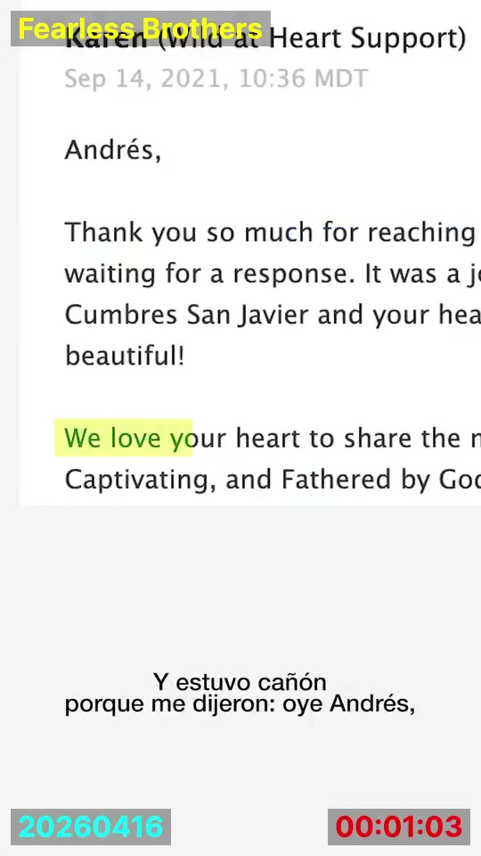

**Part 2** — Flyer costs, a meditation/prayer scene, Virgin of
Guadalupe/Juan Diego iconography, then a retreat-growth narrative: first
retreat 85 men → 3 months later 115 men → "17 RETIROS" across Mexico City,
Monterrey, Guadalajara, Acapulco, New York, etc.

**Part 3** — Continues the personal-history narration in the photo-lined
hallway (first backdrop break in the series).

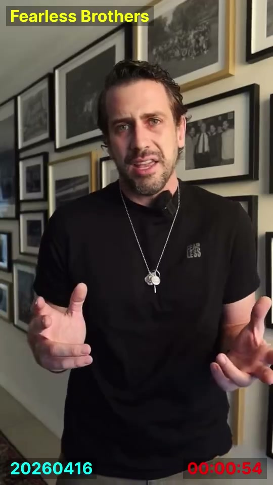

**Part 4** — Talking head on the white couch; the corner behind the plant
has an unexplained soft, diffuse bright vertical light band, ambiguous in
these stills (consistent with either a window+curtain or a compositing
seam — no color-fringing/keying tell visible at this resolution either way).

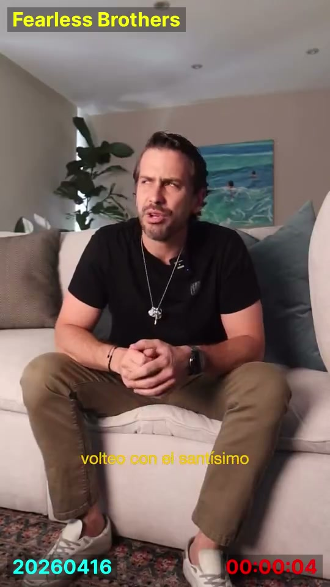

**Part 5** — Same couch room as Part 4 for the first 16s (recycled set,
same light anomaly, still unexplained), then a hard, unacknowledged cut to
a totally different "law office"-style room. Names Jordan Peterson as
supposedly "coming to Mexico City" — flagged per John: Peterson was
gravely ill this entire period and made no public appearances.

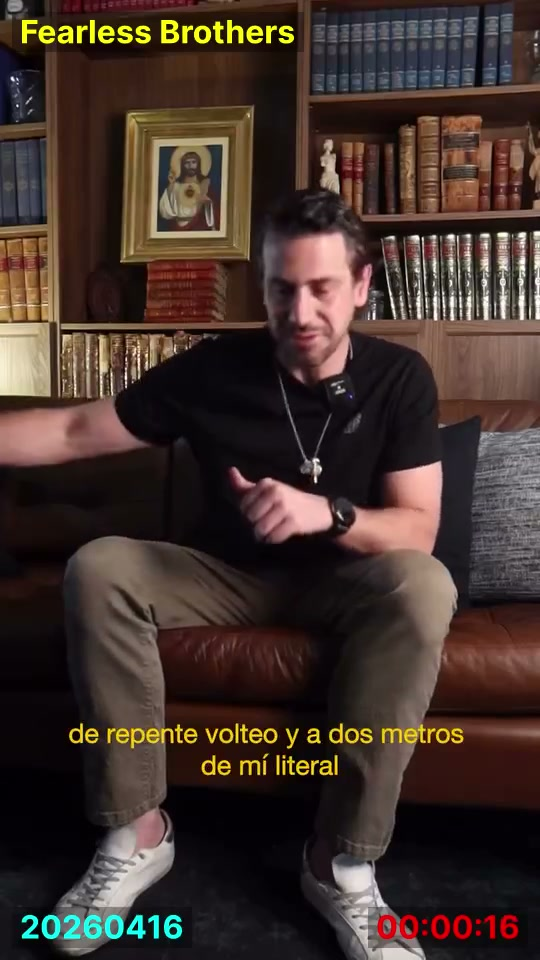

**Part 6** — Posted one day before the conference, from an unexplained
raw/unfinished space (paint buckets, exposed shelving), with zero
on-camera acknowledgment of the setting. Narrates a flashback (not
"today"): meeting Eduardo Verástegui (real *Sound of Freedom* producer) at
a restaurant, an unnamed stranger secretly paying their bill, then the
August venue crisis — Arena Guadalajara lost to a thrice-rescheduled
concert, and Jim Caviezel (played Ballard in *Sound of Freedom*) cancelling
a confirmed speaking slot over a film conflict.

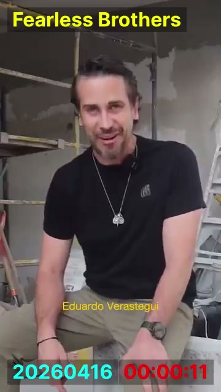
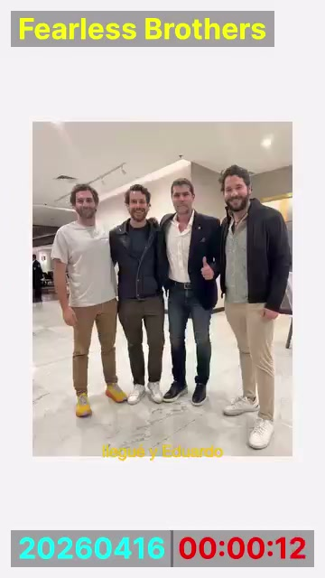
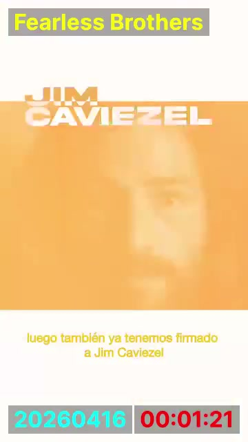

**Part 7** — Possibly genuine on-location footage (church steps, matches
the actual venue's architecture). The most escalated claim chain in the
series: a private audience with **Cardinal Kevin Joseph Farrell**, named
explicitly as "el camarlengo" (Camerlengo); a claimed gift of a white
zucchetto made to the Pope's own measurements, delivered to him in person
at a general audience; and "la bendición del Santo Padre" for the
conference. **Internally impossible as told**: Farrell is called "el papa
interino" (the interim pope) — no such office exists; the Camerlengo
administers Vatican affairs specifically *because* there is no pope
(sede vacante), so he cannot simultaneously be "the interim pope" and
grant "the Holy Father's blessing." The closing line — "besides Pope
Francis's blessing, we now await the new Pope's" — casually spans a full
papal transition with no acknowledgment a pope died mid-story. No date is
given anywhere for the Rome trip itself (unusual, since other parts of the
story carry specific dates).

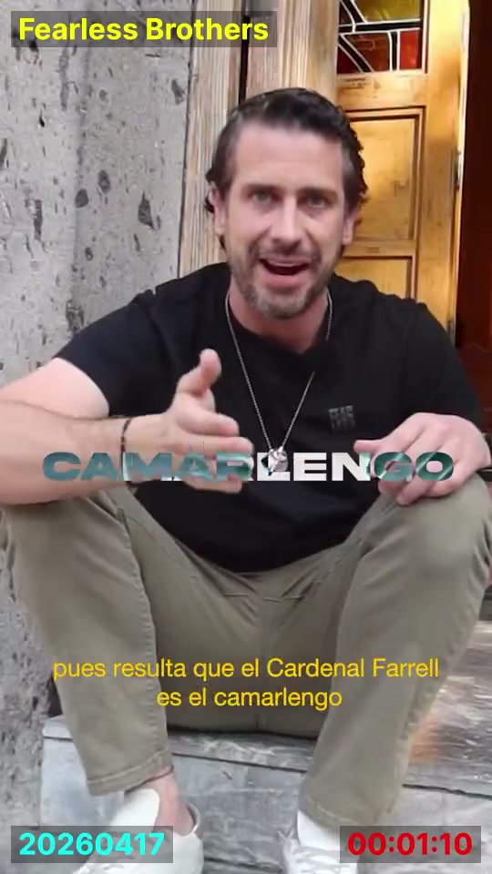

Real photo/video frames from the Vatican sequence (isolated in
`pope_photos_only.jpg`, this session's scratch dir) show genuine St.
Peter's Square general-audience footage — a physical white zucchetto held
up in hand, an actual Vatican letterhead ("PREFETTURA DELLA CASA
PONTIFICIA, CITTÀ DEL VATICANO") — but the pope's face is never visible in
any frame; his identity is asserted only by narration.

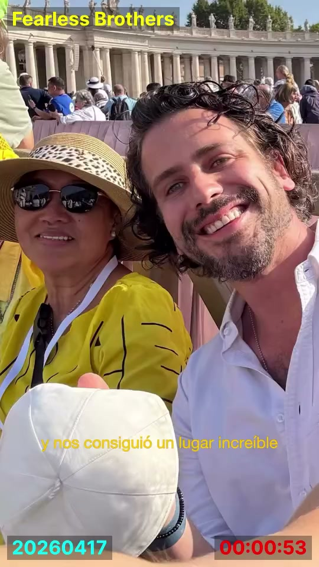
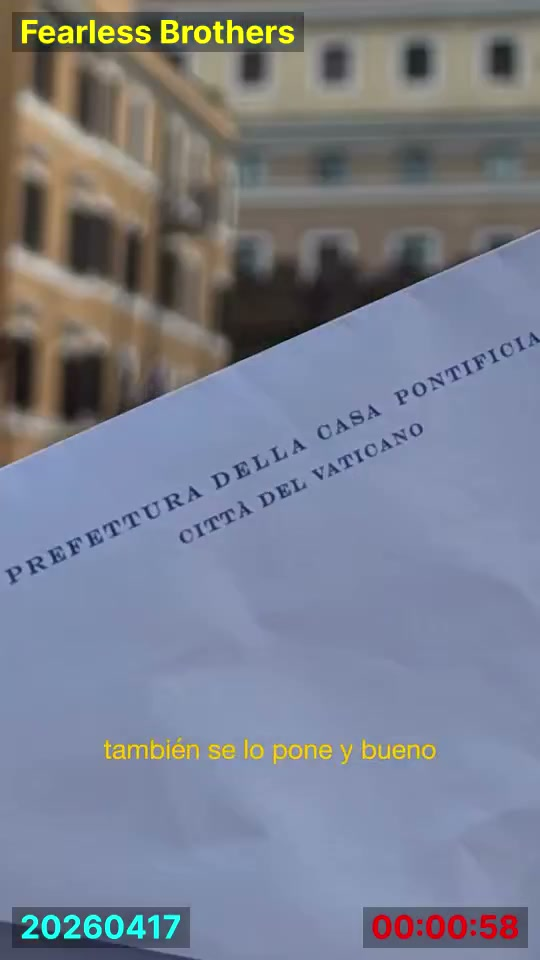

**Recycled broadcast footage, not their own** — the clearest single tell
in the whole series. A shot of the Pope's back, in a popemobile-style
vehicle, has an actual **Vatican News logo burned into the frame**
(bottom-left, red bug, the papal-tiara-and-keys emblem + "VATICAN NEWS"
wordmark). The on-screen caption at that exact moment reads **"hasta
salimos en Vatican News"** ("we even appeared on Vatican News") — phrased
as a boast about being visible in Vatican News's crowd coverage, not as a
disclosure that the clip on screen *is* Vatican News's own footage. The
edit presents it as continuous first-person experience of "the moment the
Pope passed by," using a third-party broadcaster's b-roll with that
broadcaster's own watermark still on it. Same mechanism as the recycled
B-roll already documented in `gvjp6bcvq4_frame_analysis_2026-08-30.md`,
but more brazen — the source is openly stamped on the footage itself.
Separately, the "CAMARLENGO" explanation is illustrated with what reads as
real conclave setup footage (Sistine Chapel red ballot urns, cardinals'
seating) — a second likely stock-footage insert, not yet source-traced.

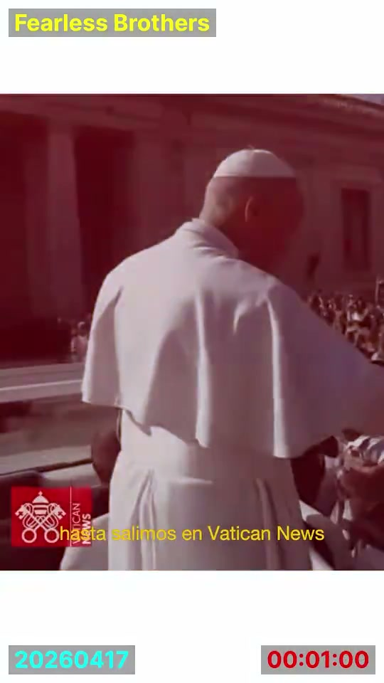

**Part 9** — Rooftop backdrop. Claims three relics received from strangers
in casual encounters: a Pier Giorgio Frassati relic (internally consistent
— he's a real beatified mountaineer, and third-class relics are a normal
Catholic devotional item); a fragment "from the pillow John Paul II died
on" (illustrated only with a generic stock JPII portrait, no unique
photo); and "a piece of the Shroud of Turin" (illustrated with a real
close-up of a small reliquary pendant) — the standout impossible claim,
since the Shroud is a single, intact, strictly guarded relic with no
legitimate channel for "pieces" to circulate as personal gifts. Also
claims a "digital missionary" network of 130+ influencers with 15M+
combined followers, and international attendees from the Philippines,
US, Dominican Republic, Guatemala, El Salvador, Argentina, Venezuela,
Colombia, and Spain.

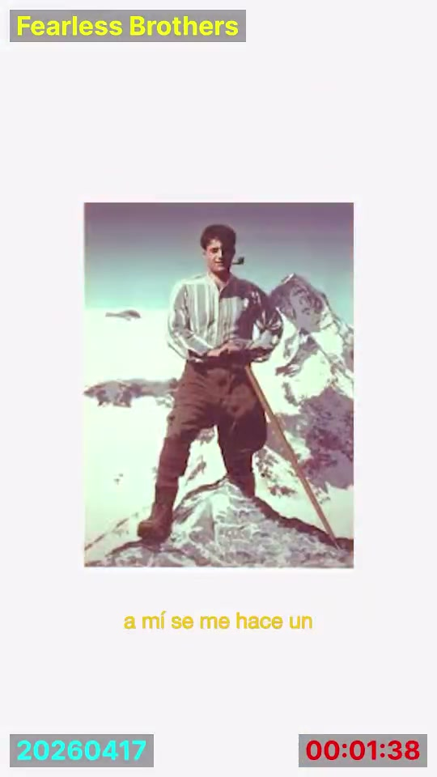
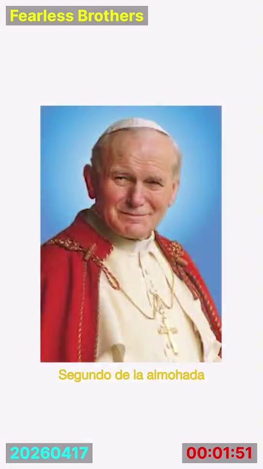
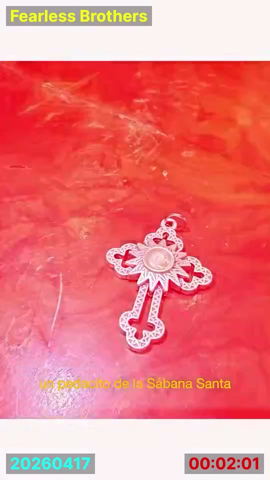

## Inventario de afirmaciones / Truth claims inventory

Resumenes parafraseados de cada afirmacion comprobable o de tercero hecha
en la serie, no transcripcion literal. Tipo: **[H]** = hecho en principio
verificable (fecha, evento, reserva, empleo); **[T]** = afirmacion sobre
un tercero, no verificable de forma independiente; **[E]** = experiencia
espiritual/providencial, no falsable por diseno.

*Paraphrased summaries of every checkable or third-party claim made across
the series, not verbatim transcript reproduction. Type: **[F]** =
in-principle verifiable fact (date, event, booking, employment); **[T]** =
claim about a third party, not independently checkable; **[S]** =
spiritual/providential experience, unfalsifiable by design.*

**Parte 1**
1. [F] Leyo *Salvaje de Corazon* (John Eldredge) en 2017, recomendado por
   su director espiritual. / Read *Wild at Heart* in 2017, recommended by
   his spiritual director.
2. [F] Daba clases de filosofia y teologia moral en el colegio Cumbres San
   Javier (Legionarios de Cristo). / Was teaching philosophy/moral
   theology at the Cumbres San Javier school (Legionaries of Christ).
3. [T] Afirma que, tras varios correos, la escuela le informo que el autor
   (Eldredge) queria una llamada con el. / Claims that after several
   emails, the school told him the author (Eldredge) wanted a call with
   him.

**Parte 2**
4. [T] Afirma que Eldredge dijo que era "la respuesta a mis oraciones,"
   ofrecio volar a Mexico pero no pudo por la pandemia (2021), y en su
   lugar regalo todo el material del retiro. / Claims Eldredge called it
   "the answer to my prayers," offered to fly to Mexico but couldn't due
   to the pandemic (2021), and instead gave away all the retreat material
   for free.
5. [S] Afirma una experiencia de oracion sintiendo la presencia de la
   Virgen de Guadalupe, origen del nombre "Fieles" (Fearless). / Claims a
   prayer experience feeling the Virgin of Guadalupe's presence, the
   origin of the name "Fieles" (Fearless).
6. [F] Primer retiro: 85 hombres. / First retreat: 85 men.
7. [F] Segundo retiro, 2 meses despues: 115 hombres. / Second retreat, 2
   months later: 115 men.
8. [F] 2022-2025: "17 retiros" en Ciudad de Mexico, Monterrey,
   Guadalajara, Leon, Acapulco, Puebla, Queretaro, y uno en ingles en
   EE.UU. / 2022-2025: "17 retreats" across Mexico City, Monterrey,
   Guadalajara, Leon, Acapulco, Puebla, Queretaro, and one in English in
   the US.

**Parte 3**
9. [T] Anecdota de un joven no identificado que dice que el retiro le
   "devolvio las ganas de vivir." / Anecdote of an unnamed young man who
   says the retreat "gave him back the will to live."
10. [T] Anecdota de invitar a su propio padre al retiro; el padre
    supuestamente dijo despues que "nadie le enseno a ser padre ni
    esposo." / Anecdote of inviting his own father to the retreat; the
    father allegedly said afterward that "no one taught him to be a
    father or husband."

**Parte 4**
11. [S] Afirma una experiencia de oracion en una capilla, invierno de
    2024, pidiendo un congreso para "10,000" personas. / Claims a prayer
    experience in a chapel, winter 2024, asking for a congress for
    "10,000" people.
12. [T] Afirma que le "vino a la mente" una lista de nombres a invitar:
    Jordan Peterson, John Eldredge, Christopher West, Eduardo Verastegui
    (y un cuarto nombre, poco claro en el audio). / Claims a list of
    names "came to mind" to invite: Jordan Peterson, John Eldredge,
    Christopher West, Eduardo Verastegui (and a fourth name, unclear in
    the audio).
13. [T] Afirma un encuentro casual el mismo dia con un conferencista
    ("Choby," frente a 8,000 personas) que le dio su WhatsApp minutos
    despues de orar por ello. / Claims a chance encounter the same day
    with a speaker ("Choby," in front of 8,000 people) who gave him his
    WhatsApp minutes after praying about it.
14. [T] Afirma una segunda coincidencia: tras orar sobre invitar a
    Christopher West, recibe una llamada de un contacto que termina
    sentandolo en el lugar reservado de West en una misa. / Claims a
    second coincidence: after praying about inviting Christopher West, he
    gets a call from a contact that ends with him seated in West's
    reserved spot at a Mass.

**Parte 5**
15. [T] Afirma haber dado un "mensaje" a Christopher West durante la
    comunion sobre pureza sexual, y que West se emociono hasta las
    lagrimas. / Claims giving Christopher West a "message" during
    communion about sexual purity, and that West got emotional to tears.
16. [F] Afirma que, 12 semanas despues, Jordan Peterson se presento en el
    Auditorio Nacional (Ciudad de Mexico) y compro boletos por
    Ticketmaster. **Senalado por John: Peterson estuvo gravemente
    enfermo todo este periodo y no hizo apariciones publicas.** / Claims
    that 12 weeks later, Jordan Peterson performed at the Auditorio
    Nacional (Mexico City) and he bought tickets via Ticketmaster.
    **Flagged by John: Peterson was gravely ill this entire period and
    made no public appearances.**
17. [S] Afirma un sueno profetico la noche anterior sobre pararse en una
    silla con un cartel. / Claims a prophetic dream the night before
    about standing on a chair with a sign.
18. [T] Afirma haber pagado 250 dolares por una foto con Peterson via un
    codigo QR (solo 100 boletos disponibles), y que Peterson le pregunto
    su nombre y comento sobre el proyecto del congreso. / Claims paying
    $250 for a photo with Peterson via a QR code (only 100 tickets
    available), and that Peterson asked his name and commented on the
    congress project.

**Parte 6** (ver tambien la seccion de arriba)
19. [T] Afirma un encuentro casual con Eduardo Verastegui en un
    restaurante, anos despues de haberse conocido en el estreno de una
    pelicula. / Claims a chance restaurant encounter with Eduardo
    Verastegui, years after meeting at a movie premiere.
20. [T] Afirma que un desconocido en el restaurante, tras "predicarle,"
    pago la cuenta completa en secreto. / Claims an unnamed stranger at
    the restaurant, after being "preached to," secretly paid the entire
    bill.
21. [F] Afirma haber reservado la Arena Guadalajara, cancelada por un
    concierto reprogramado "tres veces." / Claims having booked Arena
    Guadalajara, cancelled due to a concert rescheduled "three times."
22. [F] Afirma que Jim Caviezel ya estaba confirmado como orador y
    cancelo por un conflicto de filmacion. / Claims Jim Caviezel was
    already confirmed as a speaker and cancelled over a filming conflict.

**Parte 7** (ver tambien la seccion de arriba)
23. [F] Afirma una audiencia privada con el Cardenal Kevin Farrell,
    identificado (incorrectamente) como "el papa interino." / Claims a
    private audience with Cardinal Kevin Farrell, identified (incorrectly)
    as "the interim pope."
24. [T] Afirma haber entregado un solideo blanco a la medida del Papa y
    una carta durante una audiencia general. / Claims delivering a white
    zucchetto made to the Pope's size and a letter during a general
    audience.
25. [T] Afirma que Farrell le dio "la bendicion del Santo Padre" para el
    congreso. / Claims Farrell gave him "the Holy Father's blessing" for
    the congress.
26. [T] Afirma que Farrell menciono que la proxima Jornada Mundial de la
    Juventud aun no tiene sede, y que Andres propuso Mexico 2031 (500
    aniversario de Guadalupe). / Claims Farrell mentioned the next World
    Youth Day has no host city yet, and Andres pitched Mexico 2031 (500th
    anniversary of Guadalupe).
27. La transcripcion muestra el texto en pantalla "hasta salimos en
    Vatican News" sobre una toma con el logo real de Vatican News —
    presentada como metraje personal, no como material de archivo de
    terceros. / The transcript shows on-screen text "we even appeared on
    Vatican News" over a shot bearing the real Vatican News logo —
    presented as personal footage, not third-party archival material.

**Parte 9**
28. [T] Afirma haber recibido una reliquia de Pier Giorgio Frassati de una
    mujer en un rosario. / Claims receiving a Pier Giorgio Frassati relic
    from a woman at a rosary event.
29. [T] Afirma haber recibido un fragmento "de la almohada" en la que
    murio Juan Pablo II, de un contacto en un canal de noticias. / Claims
    receiving a fragment "from the pillow" John Paul II died on, from a
    contact at a TV news channel.
30. [T] Afirma haber recibido "un pedacito de la Sabana Santa" del mismo
    contacto. / Claims receiving "a little piece of the Shroud of Turin"
    from the same contact.
31. [F] Afirma una red de "misioneros digitales": 130+ influencers, 15M+
    seguidores combinados. / Claims a "digital missionary" network: 130+
    influencers, 15M+ combined followers.
32. [F] Afirma asistentes internacionales de Filipinas, EE.UU., Republica
    Dominicana, Guatemala, El Salvador, Argentina, Venezuela, Colombia y
    Espana. / Claims international attendees from the Philippines, US,
    Dominican Republic, Guatemala, El Salvador, Argentina, Venezuela,
    Colombia, and Spain.

**Nota metodologica / Methodological note:** ninguna de estas afirmaciones
ha sido verificada de forma independiente en esta sesion (salvo donde se
indica lo contrario). El etiquetado [F]/[T]/[S] describe el *tipo* de
afirmacion, no su veracidad. / None of these claims have been
independently verified in this session (except where noted otherwise).
The [F]/[T]/[S] tagging describes the claim's *type*, not its truth value.

## Cross-cutting patterns

- **Escalating real-figure name-drops**, in order of appearance: Eduardo
  Verástegui → Jim Caviezel → Jordan Peterson → Cardinal Kevin Farrell +
  "the Pope" → Pope John Paul II + the Shroud of Turin. Each is a specific,
  checkable-in-principle claim about a real public figure's
  presence/endorsement/involvement, none independently sourced.
- **Manufactured crisis-then-redemption arcs**: the Arena
  Guadalajara/Caviezel venue crisis (Part 6) and the "problems came" →
  "like para parte 8" cliffhanger (Part 7) both follow the same shape as
  the retreat-growth numbers (85 → 115 → 17 retiros) and the original
  9-part testimony's own burst-posting timing — a rhetorical pattern, not
  a claim about any individual fact's truth value.
- **Backdrop discontinuity with zero acknowledgment**, both between parts
  and — in Part 5 — within a single supposedly-continuous segment.
- **Wiki-usability**: none of this is currently citable per the project's
  established standard (see `r7au_gvjp_wiki_claim_sort_2026-08-31.md` and
  `gvjp6bcvq4_frame_analysis_2026-08-30.md`) — everything here is original
  analysis of primary-source material, not yet picked up by an independent
  secondary source. Same rule as the najib_expose material: usable for
  response-video content now; would need independent publication of the
  same findings before it could support a Wikipedia edit.

## Asset index

Per-part pipeline output (repo-relative, symlinked to
`E769-0C67/boner_vault/dl_wm_outputs/`):

```
dl_wm/outputs/2026-09-06/instagram__DXMqbuojRo5/   (Part 1)
dl_wm/outputs/2026-09-07/instagram__DXM4kLwCYIW/   (Part 2)
dl_wm/outputs/2026-09-07/instagram__DXNL5X7h3le/   (Part 3)
dl_wm/outputs/2026-09-07/instagram__DXNWwOfBdni/   (Part 4)
dl_wm/outputs/2026-09-06/instagram__DXNYgFwhZJU/   (Part 5)
dl_wm/outputs/2026-09-07/instagram__DXNexQyhNGQ/   (Part 6)
dl_wm/outputs/2026-09-07/instagram__DXNj22XhavK/   (Part 7)
dl_wm/outputs/2026-09-06/instagram__DXOXzxkjr6m/   (Part 9)
```

Each has `<file>.txt`/`.srt` (transcript), `<file>_watermarked.mp4`, and
`scene_clips/` (per-scene `clips/*.mp4`, `screenshots/*.jpg`,
`screenshots/gallery.html`, `segments.json`, `clips_labeled_reverse.mp4`).

Illustrative frames embedded in this doc are verbatim copies (byte-for-byte
`cp`, no re-encoding/cropping) in
`docs/evidence/2026-09-07_fearless_story_series/` — the underlying image
data is unmodified from the pipeline's own screenshot output.

Session working notes/scratch scripts: `~/Desktop/claude/2026-09-06/fearless_story_series_log.txt`
(full turn-by-turn log this doc was built from) and
`~/Desktop/claude/2026-09-06/wide_scan.sh` (superseded ad hoc script, kept
for reference only — use `bin/scene_split.py` via the pipeline instead).

## Open threads

- Verify whether Caviezel's claimed booking, Peterson's claimed Mexico
  City appearance, or the Farrell/Vatican audience have any independent
  press coverage.
- Part 4/5's unexplained corner light anomaly — inconclusive from stills;
  would need the actual clip video reviewed frame-by-frame for
  flicker/reaction to settle real vs. composited.
- **Reverse image search in progress** on the two Part 7 Vatican frames
  (the Vatican-News-logo pope shot and a clean St. Peter's Square frame) —
  to find the original broadcast/photo source and confirm which general
  audience (date, and which pope) the footage actually shows. Blocked on
  the same manual step as the najib_expose search: Google
  Images/TinEye/Yandex don't take a local file via URL, and Claude-in-Chrome
  can't drive an OS file picker to grab an arbitrary local file — needs a
  human to drag the file into the browser tab.
- Source-trace the likely second stock-footage insert in Part 7 (conclave
  setup — red ballot urns, cardinals' seating — shown under the
  "camarlengo" explanation).
- Confirm whether Part 7's church-steps location is actually Santuario de
  los Mártires (the documented real venue) or another location.
